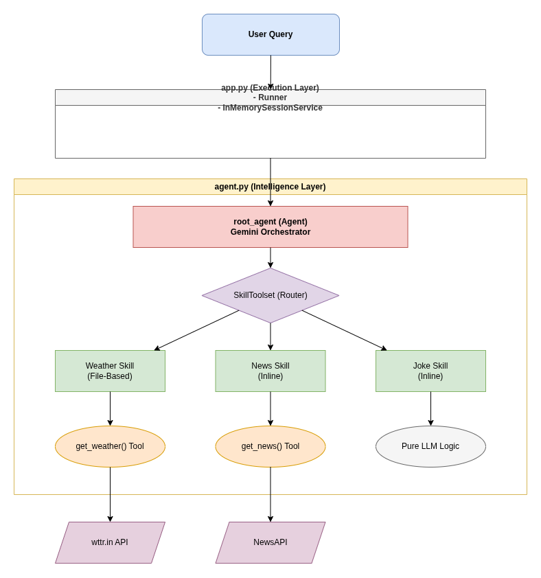

# Weather & News Skill Agent

This project demonstrates how to build a multi-functional agent using the Google Agent Development Kit (ADK). It showcases the use of **Skills**—specialized modules that encapsulate specific domain knowledge and instructions—and how to bundle them using a `SkillToolset`.


## Features

- **Weather Skill (File-Based):** Loaded from the `skills/weather-skill` directory. It utilizes `load_skill_from_dir` to import instructions and metadata.
- **News Skill (Inline):** Dynamically created at runtime using a factory function.
- **Joke Skill (Inline):** Dynamically created at runtime to provide clean, clever humor and puns.
- **Skill Toolset:** Uses `SkillToolset` to manage multiple skills, allowing the agent to intelligently route queries to the correct specialist.
- **Real-time Tools:** Integrated with `wttr.in` for weather data and `NewsAPI` for current headlines.

## Prerequisites

- Python 3.10 or higher.
- A Google AI Studio API Key (for the Gemini model).
- A NewsAPI Key (for the news tool).

## Setup

1. **Install Dependencies:**
   Ensure you have your virtual environment activated, then install the required packages:
   ```bash
   pip install -r requirements.txt
   ```

2. **Configuration:**
   Create a `.env` file in this directory and add your API keys:
   ```env
   GOOGLE_API_KEY=your_google_api_key
   NEWS_API_KEY=your_news_api_key
   ```
## Project Structure


## Project Structure
Reference - https://medium.com/ai-in-plain-english/your-first-google-adk-agent-with-skills-build-a-weather-and-news-agent-in-30-minutes-cc61f841f480

```text
10-agent-with-skills/
├── requirements.txt            # Project dependencies (google-adk, httpx, etc.)
├── README.md                   # This documentation
└── weather_news_skill_agent/   # Main application source
    ├── agent.py                # Core orchestrator: Weather/News/Joke tools, SkillToolset, and Root Agent
    ├── app.py                  # Programmatic entry point using Runner and Session APIs
        ├── load_dotenv()                       
        ├── get_weather()                # Weather Tool
        ├── get_news()                   # news Tool
        ├── weather_skill = load_skill_from_dir()       # Weather skill - file based
        ├── news_skill = create_news_skill()            # Dynamic news skill
        ├── jokes_skill = create_joke_skill()           # Dynamic joke skill
        ├── my_toolset = skill_toolset.SkillToolset()   # Skill toolset for routing queries
        ├── root_agent = Agent()                        # Agent     
            ├── tools=[my_toolset, get_weather, get_news]       # tools list and skillset Menu 
            
    └── skills/                 # Directory for file-based modular skills
        └── weather-skill/      # specialist skill for weather logic - File based skill
            ├── SKILL.md        # Core skill instructions and frontmatter - SKILL.md is required
            └── references/     # Supplemental data (loaded conditionally)
                └── WEATHER_FORMAT.md   # L3 extended format guide
```

## How to Run

### CLI Mode (Troubleshooting)
You can interact with the agent directly from the terminal:
```bash
adk run weather_news_skill_agent
```

### Web Interface
To launch a local web UI to chat with the agent:
```bash
adk web
```

### From python code
Pass the query to the agent and print the response from python code base:
```bash
python weather_news_skill_agent/app.py 
```

## Example Queries

- "What is the weather like in London today?"
- "Give me a summary of the latest technology news."
- "I'm planning a trip to Tokyo. What's the weather there, and is there any big news I should know about?"
- "Tell me a joke about computers."

---
