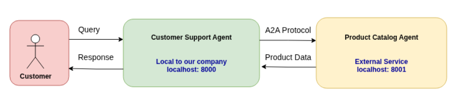

# ai-agents


## Remote Agent2Agent Communication 

This demo Demonstrates

- **Product Catalog Agent (exposed via A2A)** - External vendor service that provides product information
- **Customer Support Agent (consumer)** - Internal agent that helps customers by querying product data





Why this justifies A2A:
- Product Catalog is maintained by an external vendor (you can't modify their code)
- Different organizations with separate systems
- Formal contract needed between services
- Product Catalog could be in a different language/framework

---

Setup the remote environment

```bash
python -m venv .venv
source .venv/bin/activate
pip install -r requirements.txt

```
---


#### Start the Product Catalog Agent Server

```bash
cd 15-day5-agent2agent
uvicorn remote_a2a.product_catalog.agent-expose:a2a_app --host localhost --port 8001    # show warnings also
python -W ignore::UserWarning -m uvicorn remote_a2a.product_catalog.agent-expose:a2a_app --host localhost --port 8001   # Ignore warnings

```
---


#### Start the Customer Agent

```bash
# Star the customer Agent and provide user query
python agent
python -W ignore::UserWarning -m agent   # Ignore warnings

```
---


#### References
https://www.kaggle.com/code/ashokai2/day-5a-agent2agent-communication
